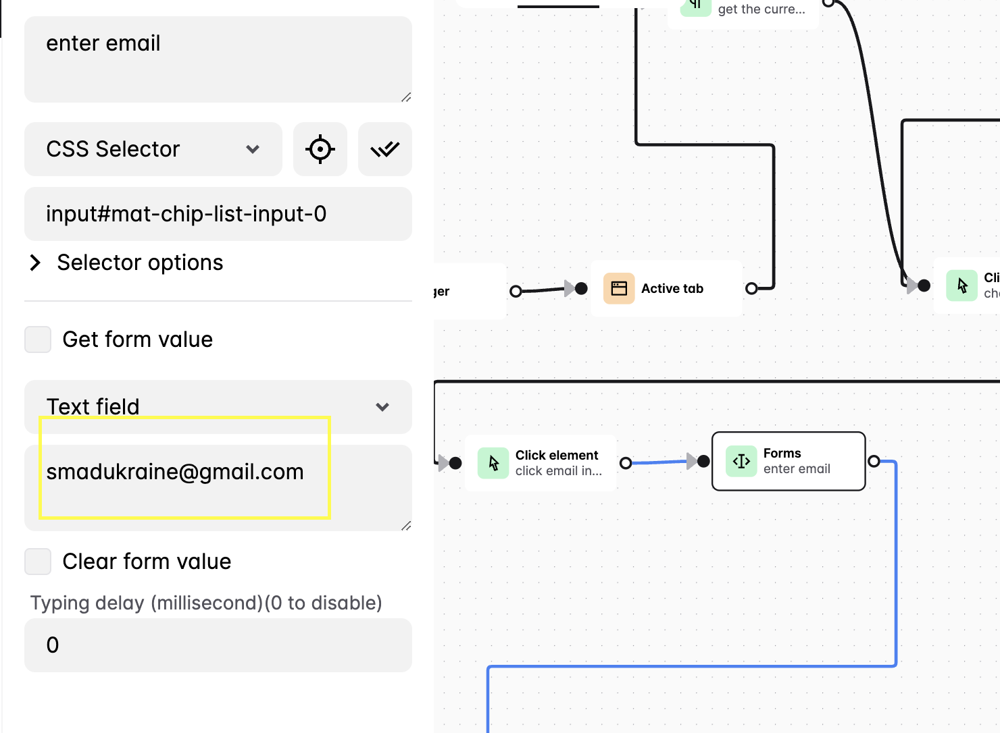
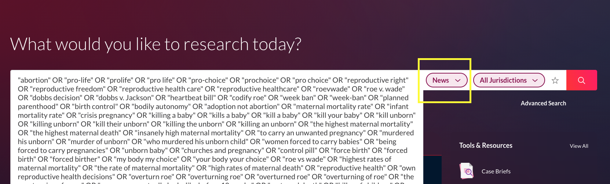
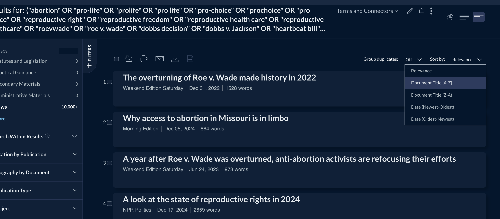
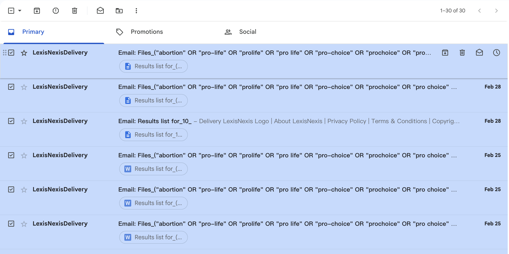
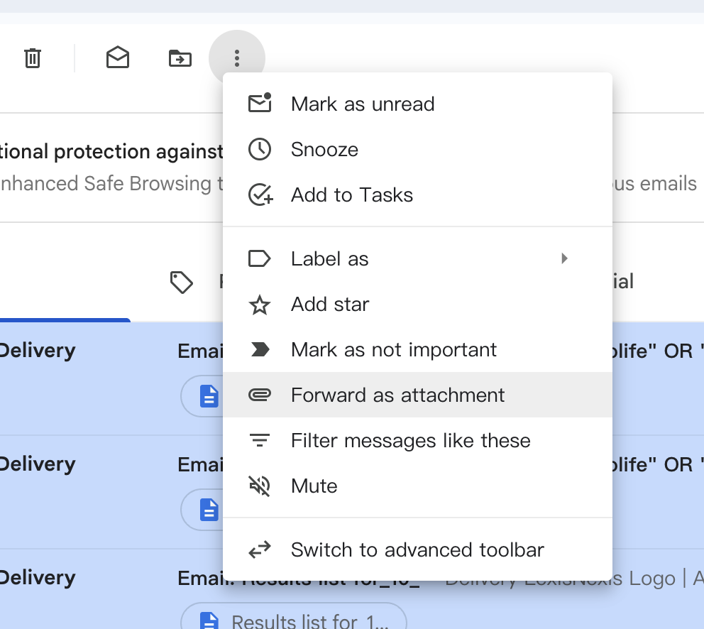
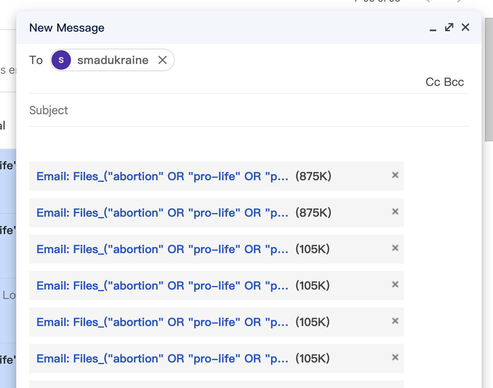
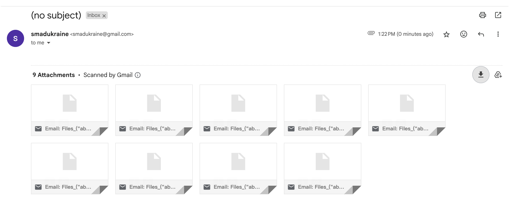

# **Automa Data Download for LexisNexis**  

This repository contains a JSON file exported from an **Automa** workflow designed for **automated data downloading** from **LexisNexis**.  

## **Prerequisites**  
Before using the workflow, ensure you have the following:  
- **Google Chrome** browser  
- **Automa** extension installed ([Get it here](https://www.automa.site/))  
- **LexisNexis** law library account access  

## **How to Use**  

### 1. **Download the JSON File**  
   - Locate and download the provided **JSON file** containing the Automa workflow.  

### 2. **Import the Workflow into Automa**  
   - Open **Google Chrome**.  
   - Click on the **Automa** extension.  
   - Navigate to **Dashboard** → **Import Workflow**.  
   - Select the downloaded JSON file and **import** it.  

### 3. **Update Email in the Workflow Settings**  
   - Locate the **Form Block** named **"enter email"** in the Automa workflow.  
   - Replace it with your **spare email account** (**Gmail preferred**).  
   

### 4. **Prepare LexisNexis for Automation**  
   - Log in to **LexisNexis**.  
   - Enter your **search query** and navigate to the results page.  
   - Ensure you select **"News"** as the **Content Type**.  
   - Wait until the page is **fully loaded** before running the workflow.  
   - Your starting page should look like this:  
     
     
   *(It is suggested that sort the search result by Title)*

### 5. **Run the Workflow**  
   - Open the **Automa extension** and locate the imported workflow.  
   - Click **Run** to start the automated data download process.  
   - The process will automatically stop after downloading the **last page** of results.  

## **Notes**  
- **Do not navigate away** from the page while the workflow is running, as this may interrupt the automation process.  
- A **complete source list** for the LexisNexis database is available in the repository as a CSV file: **`Lexis_media_list.csv`**. You can refer to this file for a comprehensive list of sources included in the search. If there is ** on the source, we are restricted to download content from it.

## **Helpful Links**  
- [How to construct a LexisNexis query for news](https://supportcenter.lexisnexis.com/app/answers/answer_view/a_id/1091245/loc/en_US/s/16777216_109661897bcd67-598b-42b6-a4c7-977f10451e3c/prTxnId/602845503/txnId/602845503/%2Fapp%2Fanswers%2Fanswer_view%2Fa_id%2F1091245%2Floc%2Fen_US#__highlight)  
- [Automa Documentation](https://docs.automa.site/)

-----

# **Download All Files in Gmail**  

### 1. **Select all emails received from LexisNexis**
   

### 2. **Select "Forward as attachment" and forward them to your email**
     
     

### 3. **Download all attachments with a single click**  
     
